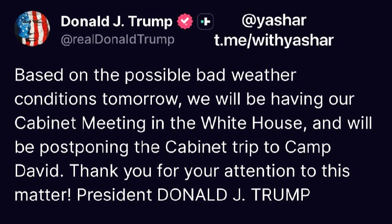

# خواننده تلگرام

<!-- TOP_NAV START -->

<!-- TOP_NAV END -->

<!-- MSG START -->

---
📅 بروزرسانی: 1405/03/06 00:22
---

## VahidOOnLine — post 242354

  <a href="telegram/content/VahidOOnLine_242354_1779828744.mp4" target="_blank">🎬 Download video</a>

مهدی خراتیان، کارشناس وابسته به حکومت، با اشاره به قصد احتمالی دونالد ترامپ بعد از انتخابات میان‌دوره‌ای ایالات متحده گفت اگر آمریکا پس از نوامبر ایران را تهدید کند و نشانه‌هایی از آمادگی نظامی دیده شود، جمهوری اسلامی باید از پیمان منع گسترش سلاح هسته‌ای خارج شود و ساخت سلاح اتمی را آغاز کند.
‌🏁 🇬🇧 IranintlTV

🤖 @VahidOOnLine

## VahidOOnLine — post 242353

  

♦️به گزارش ایسنا، سفر محمدباقر قالیباف،رئیس مجلس جمهوری اسلامی و رئیس هیئت مذاکره‌کننده جمهوری اسلامی به قطر با هدف پیگیری ترتیبات اجرایی مربوط به مطالبه جمهوری اسلامی ایران و نحوه دسترسی به ۱۲ میلیارد دلار از دارایی‌های بلوکه‌شده انجام شد.
بر اساس این گزارش، در متن یک تفاهم ۱۴ ماده‌ای پیش‌بینی شده است که ۲۴ میلیارد دلار از منابع بلوکه‌شده جمهوری اسلامی ایران در طول مذاکرات آزاد شود. هیئت مذاکره‌کننده تاکید کرده است نیمی از این مبلغ هم‌زمان با اعلام یادداشت تفاهم در دسترس قرار گیرد و بخش باقی‌مانده نیز در مدت ۶۰ روز منتقل شود.
ایسنا همچنین گزارش داد با توجه به تجربه‌های پیشین در روند آزادسازی دارایی‌های جمهوری اسلامی ایران در کره جنوبی و قطر، بر اجرای دقیق مراحل توافق تاکید شده تا مشکلات گذشته تکرار نشود. مذاکرات قطر نیز در مجموع مثبت و همراه با پیشرفت توصیف شده است.
‌🇸🇦 Indypersian

🤖 @VahidOOnLine

## WithYashar — post 12610

  

با توجه به شرایط نامساعد جوی احتمالی فردا، جلسه کابینه را در کاخ سفید برگزار خواهیم کرد و سفر کابینه به کمپ دیوید را به تعویق می‌اندازیم. از توجه شما به این موضوع سپاسگزاریم! رئیس جمهور دونالد جی. ترامپ
@withyashar

## pm_afshaa — post 91590

اگه از سرعت سرورا راضین میتونین از lex vpn که سرورارو داره به صورت رایگان بهمون میرسونه حمایت کنین @Lex_Server @Lex_Server

## pm_afshaa — post 91589

  <a href="https://t.me/pm_afshaa/91589" target="_blank">📎 Download file</a>

نپسترنت نامحدود وصل رو تمامی سرورا

💧 Rainbet.com the #1 Non-KYC Crypto Casino & Sportsbook @rainbetcom

😁 @Pm_Afshaa

## VahidOnline — post 75740

پست ترامپ:
توجه به شرایط نامساعد جوی احتمالی فردا، جلسه کابینه را در کاخ سفید برگزار خواهیم کرد و سفر کابینه به کمپ دیوید را به تعویق می‌اندازیم. از توجه شما به این موضوع سپاسگزاریم! رئیس جمهور دونالد جی. ترامپ
truthsocial.com

📡 @VahidOnline

## IranIntlTV — post 339162

  <a href="telegram/content/IranIntlTV_339162_1779828749.mp4" target="_blank">🎬 Download video</a>

مهدی خراتیان، کارشناس وابسته به حکومت، با اشاره به قصد احتمالی دونالد ترامپ بعد از انتخابات میان‌دوره‌ای ایالات متحده گفت اگر آمریکا پس از نوامبر ایران را تهدید کند و نشانه‌هایی از آمادگی نظامی دیده شود، جمهوری اسلامی باید از پیمان منع گسترش سلاح هسته‌ای خارج شود و ساخت سلاح اتمی را آغاز کند.

## Shin_Persian — post 6254

Shin ✓ @hey_itsmyturn
Tue, 26 May 2026 20:45:59 UTC

So, Mohammed Odeh, the new commander of the Izziddin Al Qassam (Military wing of Hamas) is DEAD.

فارسی

بنابراین، محمد عوده، فرمانده جدید گردان‌های عزالدین قسام (شاخه نظامی حماس) کشته شد.

𝕏 · @shin_persian

## FarsiVOA — post 218743

🔺دونالد ترامپ روز چهارشنبه با اعضای کابینه خود نشست ویژه‌ای در «کمپ دیوید» برگزار می‌کند

▪️کاخ سفید روز سه‌شنبه ۵ خرداد اعلام کرد دونالد ترامپ، رئیس جمهوری ایالات متحده، روز چهارشنبه نشست ویژه‌ای را با حضور تمام اعضای کابینه در کمپ دیوید برگزار خواهد کرد.

⬇️ بیشتر بخوانید:
https://ir.voanews.com/a/president-trump-special-camp-david-cabinet-meeting-iran/8154183.html
@FarsiVOA

## Persian_Trend_Official — post 15086

  

⭕️ محمد عوده فرمانده گردان قسام حماس توسط ارتش اسرائیل ترور شده است.

🫆:Tony

📌 @persian_trend_official
پرشین ترند | متفاوت‌ترین کانال نظامی

## alonews — post 122939

  <a href="telegram/content/alonews_122939_1779828752.webm" target="_blank">🎬 Download video</a>

👈ترامپ : فردا جلسه کابینه تو کاخ سفید برگزار می‌کنیم

✅ @AloNews خبر جنگ

## alonews — post 122938

  <a href="telegram/content/alonews_122938_1779828752.webm" target="_blank">🎬 Download video</a>

👈کانال ۱۴ اسرائیل: از افراد درون این عکس(فرماندهان حماس) هیچکس زنده نمانده

✅ @AloNews خبر جنگ

---
📅 بروزرسانی: 1405/03/06 00:12
---

## WithYashar — post 12609

## mwarmonitor — post 9776

✈️ساعت ۲۱:۲۳ به وقت گرینویچ پرواز DOOR 72 — یک فروند بمب‌افکن B-52H از پایگاه فیرفورد به پرواز درآمده و در حال ارتباط با بریز نورتن روی فرکانس 231.950 است.

@mwarmonitor

## mwarmonitor — post 9775

✈️ساعت ۲۱:۲۰ به وقت گرینویچ پرواز DOOR 73 — یک فروند بمب‌افکن B-52H از پایگاه فیرفورد به پرواز درآمده و در حال ارتباط با بریز نورتن روی فرکانس 231.950 است.

@mwarmonitor

## mwarmonitor — post 9774

  

📌یک حرکت جدید – Coronet East 024

✈️هواپیماهای سوخت رسان KC-46A با نام «BOBBY81» به شماره 19-46061 AE5FA8
و KC-46A با نام «BOBBY82» به شماره 19-46007 AE574D

✈️با کد مأموریت Coronet East 024 از خاک‌ آمریکا به پرواز درآمده‌اند. مشخص نیست که آیا از قبل هواپیمایی را همراهی می‌کردند یا اینکه این فقط یک پرواز جابه‌جایی و موقعیت‌گیری است، اما بدون شک به‌زودی مشخص خواهد شد.

@mwarmonitor

## pm_afshaa — post 91588

اگه از سرعت سرورا راضین میتونین از lex vpn که سرورارو داره به صورت رایگان بهمون میرسونه حمایت کنین @Lex_Server @Lex_Server

## pm_afshaa — post 91587

اگه از سرعت سرورا راضین میتونین از lex vpn که سرورارو داره به صورت رایگان بهمون میرسونه حمایت کنین @Lex_Server @Lex_Server

## pm_afshaa — post 91586

vless://f479f518-b927-4516-9723-52b27012aebd@185.143.234.235:2053?path=%3Fed%3D2048&security=tls&alpn=h2%2Chttp%2F1.1&encryption=none&insecure=0&host=dl.lexwill.site&fp=chrome&type=ws&allowInsecure=0&sni=dl.lexwill.site#Pmtv متصل سرعت بالا 
💧 Rainbet.com…

## Dirty_Kids — post 390274

من عادت ندارم همه چی با هم وصل باشه، هر چه سریعتر برق رو قطع کنید

@Dirty_Kids 👻

## alonews — post 122937

  <a href="telegram/content/alonews_122937_1779828136.webm" target="_blank">🎬 Download video</a>

👈تصویری از محمد عوده، فرمانده شاخه نظامی حماس که ساعاتی قبل در غزه ترور شد

✅ @AloNews خبر جنگ

## alonews — post 122936

  <a href="telegram/content/alonews_122936_1779828136.webm" target="_blank">🎬 Download video</a>

👈عوستاد خوش چشم: میتونیم بمب اتم درست کنیم و بجای اینکه بزنیم تو شهرها، بزنیم تو پایگاه‌های آمریکا

✅ @AloNews خبر جنگ

## alonews — post 122935

  <a href="telegram/content/alonews_122935_1779828136.webm" target="_blank">🎬 Download video</a>

🔴حالا مردم خودشون آنلاین شدن و دارن می‌بینن این حرام زاده های «سیم‌کارت سفید» تو این سه ماه چه مزخرفات و چرندیاتی رو به اسم مردم ایران جعل کردن و نشر دادن تو رسانه ها.

✅@AloNews

## alonews — post 122934

  <a href="telegram/content/alonews_122934_1779828137.mp4" target="_blank">🎬 Download video</a>

👈از کسایی که تو تجمعات شبانه شرکت کردن دارن میپرسن نظرتون با قطع دائم اینستاگرام چیه؟

🔴و اما جواب حامیان حکومت:

✅ @AloNews خبر جنگ

## alonews — post 122933

  <a href="telegram/content/alonews_122933_1779828138.webm" target="_blank">🎬 Download video</a>

👈وال‌استریت‌ژورنال: ایران به دنبال توافقی است که بدون واگذاری پیروزی به ترامپ، موجب آرامش اقتصادی شود

✅ @AloNews خبر جنگ

## alonews — post 122930

  <a href="telegram/content/alonews_122930_1779828139.mp4" target="_blank">🎬 Download video</a>

👈 آتش‌سوزی گسترده شهری در فیلیپین را درنوردید و 489 خانواده را تحت تأثیر قرار داد

✅ @AloNews خبر جنگ

## alonews — post 122929

  <a href="telegram/content/alonews_122929_1779828141.webm" target="_blank">🎬 Download video</a>

👈 قیمت زمین و مسکن در ژاپن همچنان از سقف تاریخی خودش در اوایل دهه ۱۹۹۰ کمتر است.

✅ @AloNews خبر جنگ

## alonews — post 122928

  

کانفیگ فروشا:

[@AloTweet]

## alonews — post 122926

  <a href="telegram/content/alonews_122926_1779828142.webm" target="_blank">🎬 Download video</a>

👈 همچنان در جهان ۲.۱ میلیارد نفر دسترسی به آب شیرین ندراند و مجمع جهانی اقتصاد تخمین می‌زند که نیاز جهانی به سرمایه‌گذاری کل تجمعی تا سال ۲۰۴۰ در زیرساخت‌های آب ۱۱.۴ تریلیون یورو است که ۶.۵ تریلیون یورو بیشتر از سطح سرمایه‌گذاری فعلی است.

✅ @AloNews خبر جنگ

---
📅 بروزرسانی: 1405/03/06 00:02
---

## pm_afshaa — post 91585

vless://f479f518-b927-4516-9723-52b27012aebd@185.143.234.235:2053?path=%3Fed%3D2048&security=tls&alpn=h2%2Chttp%2F1.1&encryption=none&insecure=0&host=dl.lexwill.site&fp=chrome&type=ws&allowInsecure=0&sni=dl.lexwill.site#Pmtv متصل سرعت بالا 
💧 Rainbet.com…

## DEJradio — post 5002

  <a href="telegram/content/DEJradio_5002_1779827531.webm" target="_blank">🎬 Download video</a>

🔺📌 کار ترامپ با جمهوری اسلامی تمام نشده است.
متاسفانه فضای رسانه‌ای و شبکه‌های اجتماعی مملو از اخباری است که موج ناامیدی را تزریق می‌کند. بسیاری از کارشناسان و تحلیل‌گرانی که سیاست کلان بین‌الملل را صرفا در فضای خبری و رسانه‌ای و شبکه های اجتماعی جست‌وجو می‌کنند، فراموش می‌کنند که این فضا از ابتدا برای نمایش، فریب، پنهان‌کاری و مدیریت افکارعمومی شکل گرفته است؛ فضایی که در آن نمی‌توان هر خبر و روایتی را بدون هدف و نیت خاصی واقعی و بی‌ جهت دانست.

توافقی که در رسانه‌های جمهوری اسلامی از آن می‌گویند، از نگاه آمریکا یک تسلیم‌‌نامه است یعنی ترامپ به دنبال تسلیم بی‌قید و شرط جمهوری اسلامی است و سرداران سپاه و تندروهای نظام نیز به خوبی می‌دانند که پذیرش چنین تسلیمی، در نهایت به معنای تن دادن به فروپاشی و سرنگونی نرم نظام خواهد بود به همین دلیل حاضر به پذیرش آن نیستند و شروطی را تعیین می کنند که عملا این توافق و یا بهتر بگوئیم تسلیم نامه ممکن نباشد.

ترامپ نیز برای وادار کردن جمهوری اسلامی به پذیرش این تسلیم، از روش‌های گوناگون استفاده می‌کند و همچنان گزینه نظامی یکی از آن روش‌هاست؛ همان‌گونه که شب گذشته نیز حملات محدودی علیه جمهوری اسلامی انجام شد.
اما نباید فراموش کنیم که در نهایت این مردم ایران هستند که کار را تمام خواهند کرد.

#ترامپ #مذاکرات
@DEJradio

## FarsiVOA — post 218742

  <a href="telegram/content/FarsiVOA_218742_1779827531.mp4" target="_blank">🎬 Download video</a>

⚡️مهدی فتا پور: هم آمریکا و هم جمهوری اسلامی خواهان توافق هستند
@FarsiVOA

## FarsiVOA — post 218741

  <a href="telegram/content/FarsiVOA_218741_1779827532.mp4" target="_blank">🎬 Download video</a>

⚡️نازیلا گلستان در برنامه تفسیر خبر: بخش ولایت فقیه جمهوری اسلامی از بین رفته است
@FarsiVOA

## IranianMinds — post 20840

  <a href="https://t.me/IranianMinds/20840" target="_blank">📎 Download file</a>

سرور فوق العاده پرسرعت و قوی مخصوص اینستا و یوتیوب سرعت فضایی مخصوص همراه اول مخابرات

آموزش اتصال در اندروید

آموزش اتصال در آیفون

حتما شیر بدید بقیه هم متصل شن لطفا دانلود سنگین هم نزنید ❤️‍🔥

@IranianMinds

## Dirty_Kids — post 390273

سلام دوستان من نتم تازه وصل شده آقای خامنه ای عید نوروز رو تبریک نگفتن اتفاقی افتاده خدایی نکرده؟

@Dirty_Kids 👻

## alonews — post 122925

  <a href="telegram/content/alonews_122925_1779827533.mp4" target="_blank">🎬 Download video</a>

🔴ویدیوی تازه‌ای از پیکر جوانان جان‌باخته در دی‌ماه ۱۴۰۴ منتشر شده؛ تصاویری از سردخانه‌ای در خرم‌آباد، همراه با فریاد دردناک مردی که می گوید: « دو برادرم رو از ما گرفتند.»

🔴این تصاویر فقط روایتِ درد نیست؛ یادآور بهایی‌ست که جوانان این سرزمین برای آزادی پرداختند.

🤔 صدای یک ملت خاموش نمی‌شود. راهی که با امید و ایستادگی آغاز شده، با آزادی و پیروزی به پایان خواهد رسید.

✅@AloNews

## alonews — post 122924

  <a href="telegram/content/alonews_122924_1779827535.webm" target="_blank">🎬 Download video</a>

👈طبق رسانه‌های عبری، ساختار امنیتی اسرائیل از کشته شدن محمد عوده، رئیس ستاد تیپ‌های عزالدین قسام، اطمینان دارد.

🔴هنوز هیچ تاییدیه رسمی منتشر نشده است، اما انتظار می‌رود که منتشر شود

✅ @AloNews خبر جنگ

<!-- MSG END -->

<!-- NAV START -->

<!-- NAV END -->
